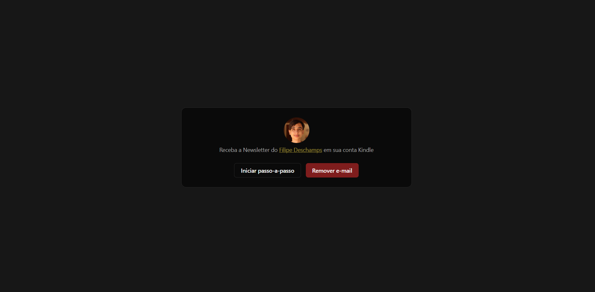

# Automatic Newsletter Sender for Kindle
 
  
   .
   ### Demo app: https://node-automail.nkportfolio.tech
# About
 This API downloads an e-mail through an IMAP server and converts it into an EPUB file.
 The EPUB file is send to your "Send to Kindle" account, which can be read through an Kindle device.
 The frontend basically shows the step-by-step guide on how to set up your Kindle account.
 The Cron Job is set up to run every day at 12pm.

# Working on
 - [ ] Logging
 - [ ] Support for [TabNews](https://www.tabnews.com.br)

# Stacks 
  ### Back-end
  - TypeScript
  - Node.js
  - Express
  - IMAP
  - Resend
  - Epub-gen
  - Prisma
  - MySQL
  - Zod
  - Node-cron
  
  ### Front-end
  - TypeScript
  - React
  - shadcn/ui
  - Tailwind
  - Axios
  - Lucide React
  - React-toastify

  ### Implantation
  - Website: https://node-automail.nkportfolio.tech
  - API: https://node-automail-api.nkportfolio.tech

  # Author
   Nicolas Klein Faria de Araujo  
   https://nkportfolio.tech
